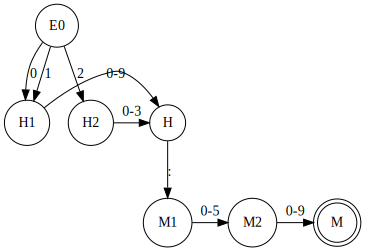

Hippolyte Guilloteau

IUT Nantes

BUT-2 groupe-1

R.412 automates et langages


# Modélisation et analyse à l'aide des automates

# Introduction

Voci mon travail de réalisation de 3 automates déterministe dans le cadre de mes études de BUT informatique à l'IUT de Nantes
lors du cours R412 automates et langages. 

Pour rappel, un automate est une machine (algorithme ou procédure) qui permet de reconnaitre les 
mots engendrés par un langage ou de décider si un mot appartient à un langage ou non.
Un automate est également une structure mathématique fondamentale, utilisée
pour modéliser, raisonner, analyser, simuler : c’est un modèle.
_(définition de C.Attiogbé)_

Dans ce markdown, vous retrouverez l'explication de 3 automates, 
un premier pour réaliser des smileys, 
un second pour la réalisation d'heure au format : `HH:MM` 
et enfin un automate permettant de vérifier qu'une adresse mail est valide. 
Vous trouverez ci-dessous des détails sur chaque automates, leur réalisation, 
quelles données sont valides ou non ainsi qu'une explication détaillé du code et de la manière d’exécuter ce dernier.

# Comment s'organise le code

Le code est organisé simplement avec un fichier ```Etat``` qui comme son nom l'indqiue représente les états et créé les transitions entre eux. 
Le fichier ```Automate``` permet de vérifier que la chaine de caratère est un mot. Pour ce faire, on vérifie que le dernier état est bien final. 
On vérifie que chaque caractère du mot est bien présent dans l'alphabet et qu'il existe une transition permettant de passer de ce caractère au suivant, 
si a un moment ce n'est pas le cas on renvoie false.

Le fichier ```MonApplication``` créer tous les automates à l'aide de fonctions dans lesquelles on déclare 
les états, l'état initial, les états finaux, l'alphabet et l'ensemble des transitions.

Dans le répertoire ```test/kotlin``` il y a égalemnt un fichier permettant de tester les automates et de vérifier qu'une chaine de caractère invalide renvoie bien KO 
et une chaine de caractère valide renvoie bien OK. 

# Comment l’exécuter

Se trouve dans le répertoire kotlin un fichier ```monAppli.jar``` pour lancer ce fichier, il vous suffit de vous placer dans le bon répertoire et de lancer la commande :
```java -jar monAppli.jar```
Un terminal va s'ouvrir vous demandant de choisir un nombre : 1 pour lancer le programme smiley, 2 pour l'heure, 3 pour l'adresse mail ou 99 pour stopper l'application.
Une fois un des programmes lancés, l'utilisateur doit entré une chaine de caractères et l'automate va lui renvoyer une réponse correct ou incorrecte en fonction de la chaine de caractère rentrée

# Les automates

<h2>Smileys</h2>

**Graphe d'automate**


L'automate smiley permet de dire si un smiley est valide ou non, voici la liste exhaustive des smileys valides.
```:), :-), :(, ;-), :=), ]-)```.

Il est composé d'un état initial E1 et d'un état final E4. Il possède 5 états.

<h2>Heure</h2>

**Graphe d'automate**



L'automate heure permet de valider qu'une heure est correcte au format ```HH:MM```. 
Il est composé de 7 états, un état initial E0 et un état final M. 
Les minutes sont comprises entre 00 et 59 et les heures entre 00 et 23.

<h2>Adresse électronique</h2>

**Graphe d'automate**


L'automate adresse permet de valider ou non le format d'une adresse email. 
Il est composé de 6 états, un état initial E0 et un état final E5.
Les adresses mails prises en compte sont les adresses correspondantes à la liste ci-dessous.
```Abc@example.com, Abc.123@example.com, user+mailbox/department=shipping@example.com, !#$%&'*+-/=?^_`.{|}~@example.com, Loïc.Accentué@voilà.fr```

# Conclusion 

Les automates sont des outils puissants pour modéliser et analyser des langages formels. Ils trouvent des applications dans divers domaines, de la reconnaissance de motifs à la validation de données. Dans ce projet, nous avons exploré trois automates conçus pour reconnaître des expressions spécifiques : des smileys, des heures au format HH:MM, et des adresses électroniques.

L'automate de smileys permet de vérifier si une séquence de caractères correspond à des émoticônes courantes. Cela pourrait être utile dans le contexte de l'analyse de textes pour repérer des émotions ou des sentiments.

L'automate pour les heures valide la syntaxe des heures au format HH:MM. Cela pourrait être utilisé dans des applications de gestion du temps pour s'assurer que les heures saisies par les utilisateurs respectent le format attendu.

Enfin, l'automate d'adresse électronique valide la conformité des adresses e-mail selon une liste spécifique. Cette fonctionnalité pourrait être intégrée dans des formulaires en ligne pour garantir que les utilisateurs fournissent des adresses e-mail correctes.

En résumé, les automates offrent une approche formelle et précise pour spécifier et valider des modèles de langages. Ce projet illustre comment ces outils peuvent être utilisés pour traiter des motifs spécifiques et garantir la conformité de données entrées par les utilisateurs.


# Aides 
Afin de réaliser ce projet, je me suis aidé de Raphaël Silly pour l'architechture du projet.

ChatGPT m'a aidé à réaliser le Main.kt et la conclusion. 

J'ai utilisé l'outil en ligne Graphiz pour réaliser les graphes d'automates. 

Afin de savoir quelles adresses mails étaient valides j'ai utilisé la page wikipédia adresse électronique.


# Conclusion 

Pour conclure, ce projet est une véritable mise en pratique de la cré